# FindMe

## 1. Цель работы
Создать интерактивное web-приложение, позволяющее пользователям угадывать географическое местоположение на основе панорамных изображений.

## 2. Функциональные требования

## Главная страница
- Система должна отображать главную страницу с кнопками:
  - **Играть** — переход к настройкам игры
  - **Войти** — переход на страницу авторизации
  - **Зарегистрироваться** — переход на страницу регистрации
  - **FAQ** — переход к часто задаваемым вопросам

## FAQ
- Система должна отображать список часто задаваемых вопросов для пользователей
- Система должна предоставлять администратору возможность добавлять новые вопросы

### Авторизация и регистрация
- Система должна предоставлять возможность входа пользователя по логину и паролю
- Система должна предоставлять возможность регистрации нового пользователя
- Система должна обеспечивать выход пользователя из системы

### Профиль
- Система должна отображать статистику игрока
- Система должна предоставлять доступ к кнопкам:
  - **Рейтинг** — переход на страницу рейтинга
  - **Играть** — переход к настройкам игры
  - **Выйти** — завершение сессии пользователя

### Рейтинг
- Система должна отображать топ-3 игроков
- Система должна предоставлять доступ к кнопкам:
  - **Профиль** — переход на страницу профиля
  - **Играть** — переход к настройкам игры
  - **Выйти** — завершение сессии пользователя

### Игра
- Система должна позволять игроку выбрать локацию для игры
- Система должна генерировать карту с панорамой
- Система должна генерировать мини-карту, где игрок указывает предполагаемую точку
- Система должна фиксировать выбор игрока
- Система должна рассчитывать очки игрока
- Система должна отображать итоги игры после завершения раунда
- Система должна предоставлять администратору возможность добавлять новые локации

### Результаты игры
- Система должна отображать результаты
- Система должна предоставлять игроку возможность оставить отзыв об игре
---

## 3. Use-case диаграммы  
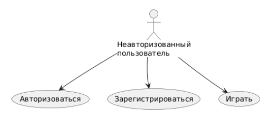
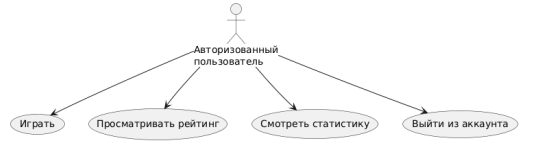
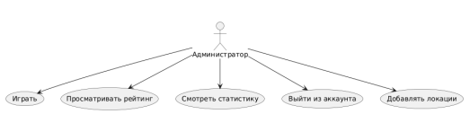
---

## 4. BPMN диаграммы бизнес-процессов
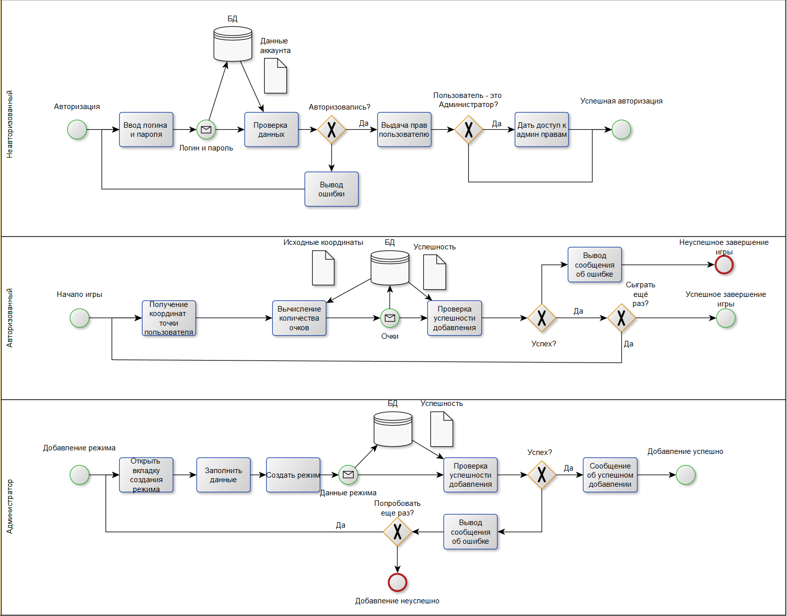

---

## 5. Пользовательские сценарии

### Сценарий участия в игре
1. Авторизоваться на сайте
2. Нажать на кнопку "Начать игру"
3. Выбрать интересующую локацию
4. Угадать локацию на мини-карте
5. Посмотреть результат игры и получить свои очки

### Сценарий просмотра личной статистики
1. Авторизоваться на сайте
2. Нажать на кнопку "Профиль"

### Сценарий добавления локации (для администрации)
1. Авторизоваться на сайте
2. Нажать на кнопку "Начать игру"
3. В окне "Добавить локацию" указать название локации, а также координаты точки
4. Нажать "Добавить точку"

---

## 6. ER-диаграмма сущностей
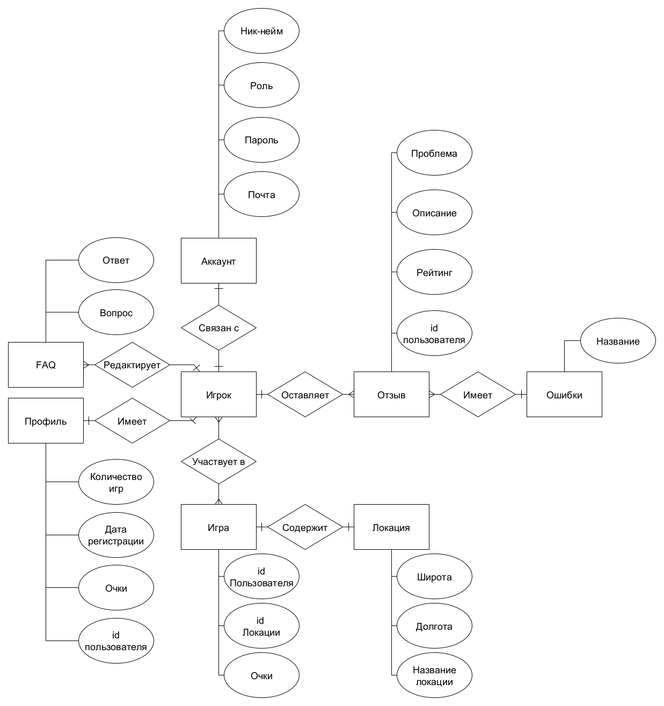

---

## 7. Технологический стек
- **Backend:** Java, Springboot  
- **Frontend:** Angular + css  
- **БД:** PostgreSQL
- **Доставка:** Локальный запуск 

---

## 8. Диаграмма БД
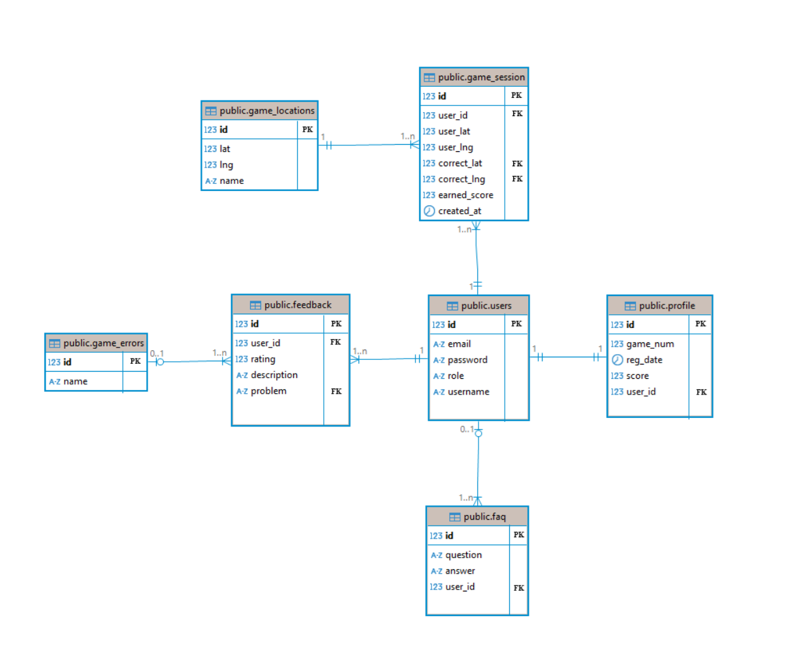

---

## 9. Компонентная диаграмма системы
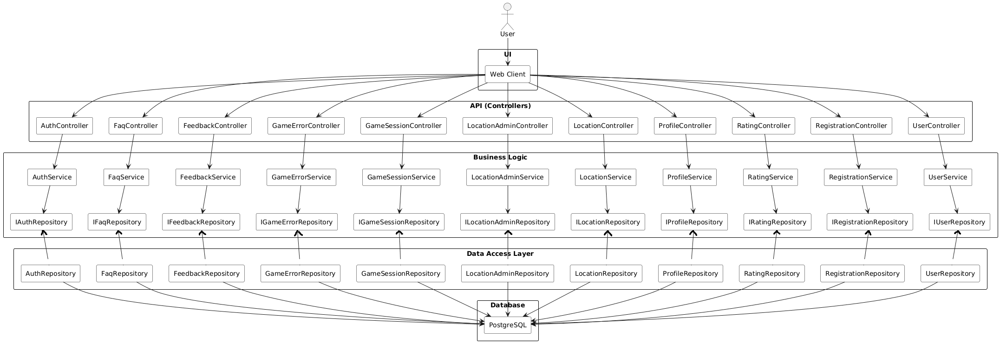

---

## 10. Экраны web-приложения (черновые эскизы)

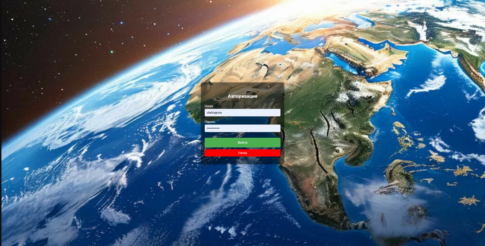
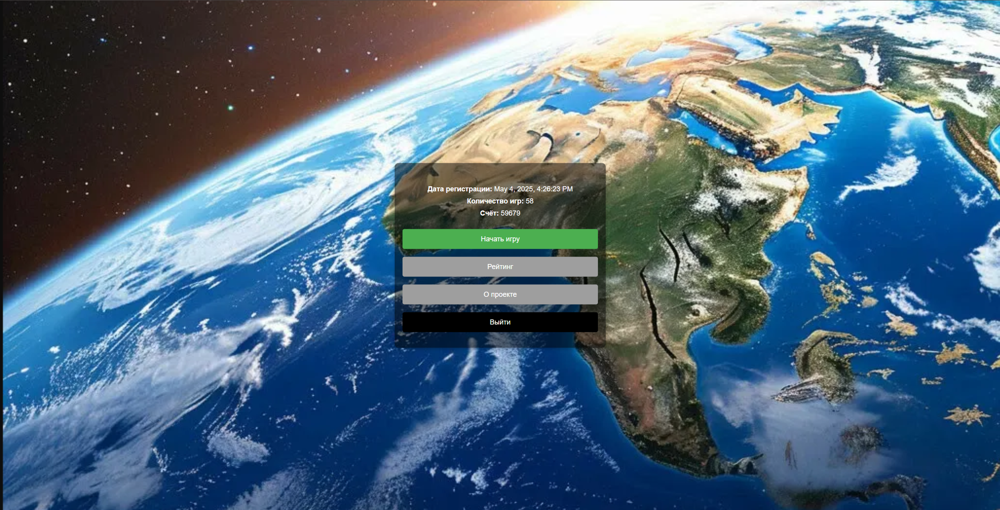
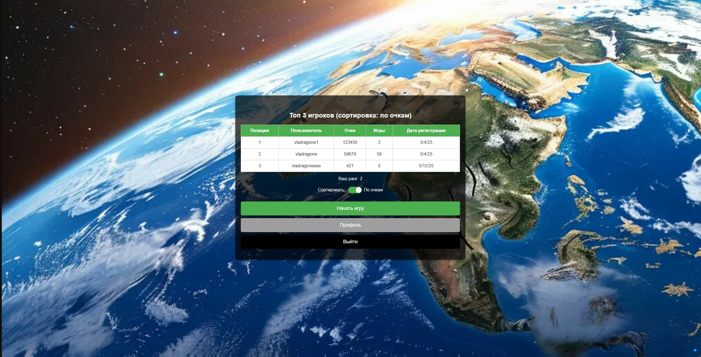
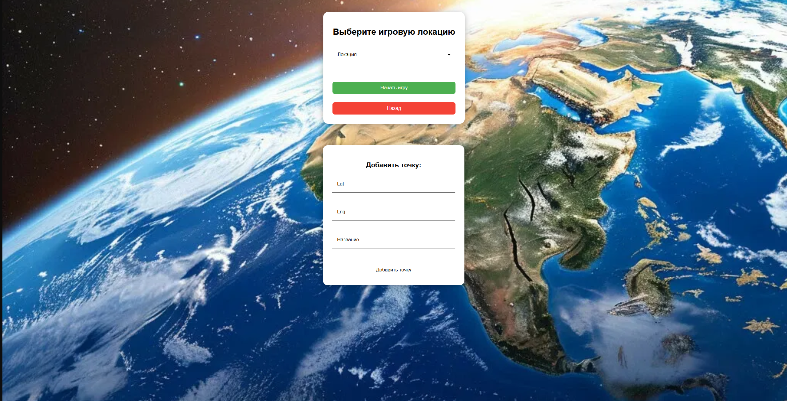
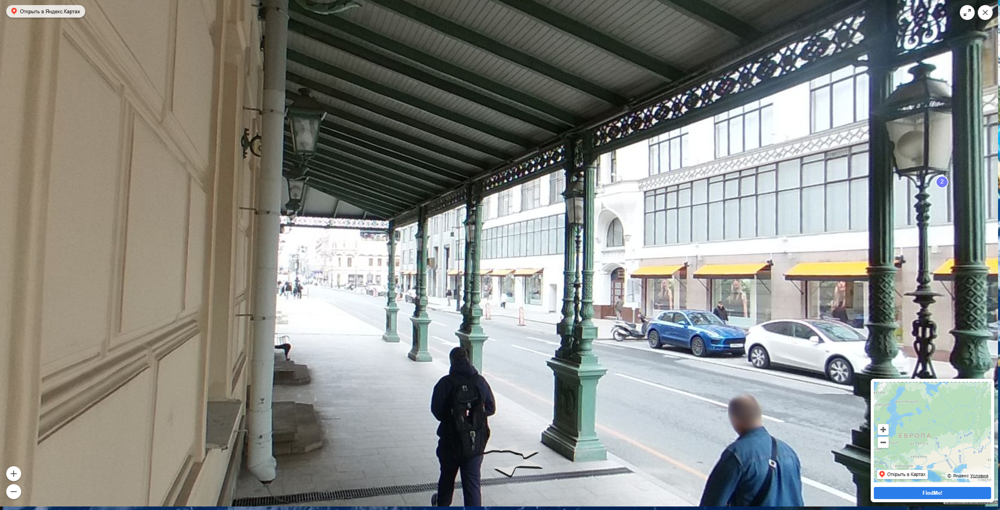
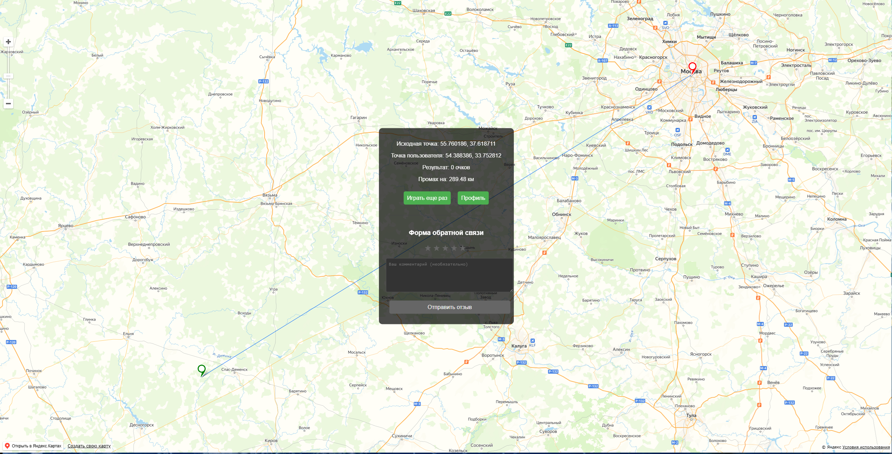
---

