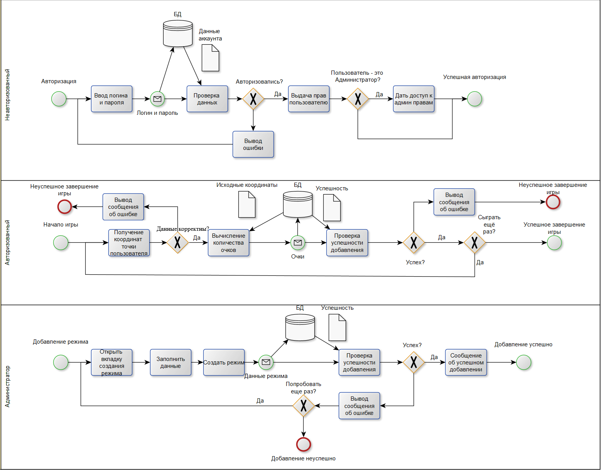
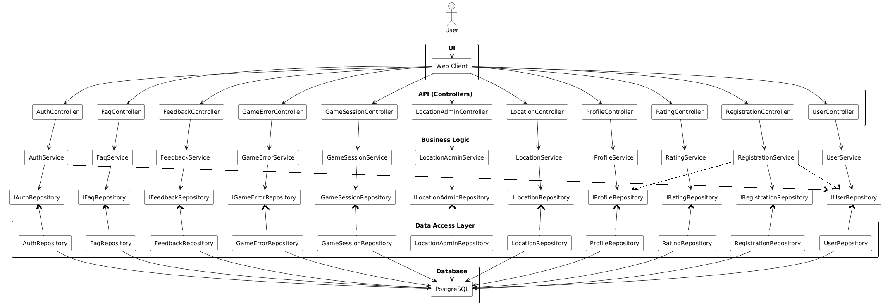

# FindMe

## 1. Цель работы
Создать интерактивное web-приложение, позволяющее пользователям угадывать географическое местоположение на основе панорамных изображений.

## 2. Функциональные требования
---

## 3. Use-case диаграммы  

---

## 4. BPMN диаграммы бизнес-процессов

---

## 5. Пользовательские сценарии

### Сценарий участия в игре
1. Авторизоваться на сайте
2. Нажать на кнопку "Начать игру"
3. Выбрать интересующую локацию
4. Угадать локацию на мини-карте
5. Посмотреть результат игры и получить свои очки

### Сценарий просмотра личной статистики
1. Авторизоваться на сайте
2. Нажать на кнопку "Профиль"

### Сценарий добавления локации (для администрации)
1. Авторизоваться на сайте
2. Нажать на кнопку "Начать игру"
3. В окне "Добавить локацию" указать название локации, а также координаты точки
4. Нажать "Добавить точку"

---

## 6. ER-диаграмма сущностей

---

## 7. Технологический стек
- **Backend:** Java, Springboot  
- **Frontend:** Angular + css  
- **БД:** PostgreSQL
- **Доставка:** Локальный запуск 

---

## 8. Диаграмма БД

---

## 9. Компонентная диаграмма системы

---

## 10. Экраны web-приложения (черновые эскизы)

---

